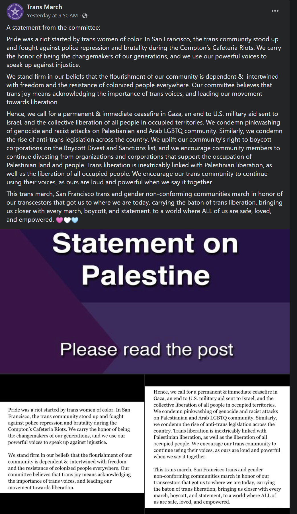

# Israel has the right to exist. 

[Plain text version](israel_trans_march.txt)

Israel has the right to exist. If you disagree with this basic idea then kindly GTFO. Especially if you're willing to assault me over it, like someone did at the Trans March.

This was supposed to be a post about the 2024 San Francisco Trans March, about how trans rights are rapidly deteriorating all across the world, how Russia is likely to hit me with felony charges if I ever step a foot there, how it's unsafe for me to travel to many US states, and how you shouldn't even pretend to care about my life if you live in a swing state (or district) and want to **not** vote for Democrats.

But the organizers of the Trans March decided that ["trans liberation is inextricably linked with Palestinian liberation" and call for "collective liberation of all people in occupied territories."](https://www.facebook.com/transmarch/posts/pfbid02TyAEaiKZQ9eoUjKk8vT8V1ebkvG7GiafQmjeWxfAFkDiH2H22A2gZwFT1yZsZARzl) Fine. Let's make it about Palestine.

I didn't want to talk about this war, even though I have more skin in this game and more first-hand knowledge about it than most Americans who opine on this matter non-stop. My step sister lives in Israel, and my mother could probably qualify for the citizenship, and it would've been the only plausible way for her to escape Russia in the foreseeable future had she not been too disabled to go through the whole process by herself. Many of my friends live or have families in Israel, some of my family friends growing up had fled there from the antisemitic persecution in the Soviet Union decades ago, and there are many more. These people fled there from the Soviet violent [antisemitic](https://www.jewishberkshires.org/community-events/berkshire-jewish-voice/berkshire-jewish-voice-highlights/why-are-jews-from-the-former-soviet-union-often-called-russians) [persecution](https://en.wikipedia.org/wiki/Anti-cosmopolitan_campaign), from homophobic or transphobic persecution in Russia, from political persecution in Russia for their anti-Putin anti-war positions. They had nowhere else to go, because no one else wanted them; emigrating is actually much more difficult than showing up at the border and saying "I'm persecuted." Jews fleeing the Nazis tried that. [It failed](https://en.wikipedia.org/wiki/%C3%89vian_Conference), [no one wanted them](https://en.wikipedia.org/wiki/MS_St._Louis), which is what demonstrated the necessity of having a place free from antisemitic persecution in the first place. So far no one that I know personally was killed, but they are in fact getting bombed pretty regularly. So these horrific events affect me on a deep personal level. But I generally keep this to myself because I can't affect the situation in any way, and also because I lack the necessary in-depth knowledge to even form an educated opinion on what exact policy I would want to advocate for, and this knowledge is difficult to obtain due to the barrage of disinformation, misunderstandings, and propaganda about this topic, and it's often spread for hateful reasons even by people who aren't even involved in the conflict in any way. Again, I probably know more than most Americans who opine on this issue, and I still feel like I need to know more in order to have a sensible opinion.

But if I were to join a march that's now officially about the Palestinian liberation, I wanna know what this "liberation" means. I mean, "liberation" sounds nice, but last last October we were [informed in no uncertain terms](https://x.com/najmamsharif/status/1710689657757769783) that "decolonization" apparently means "showing up to a music festival and murdering and kidnapping civilians." At the same time we're being told that ["from the river to the sea is an aspirational call for freedom, human rights, and peaceful coexistence, not death, destruction, or hate"](https://www.nbcnews.com/politics/congress/rep-rashida-tlaib-faces-criticism-democrats-palestinian-remarks-rcna123735), even though last time I checked the map, the stretch between the Jordan river and Mediterranean sea contained the entire territory of Israel. And there does seems to be a tendency to really quickly go from talking about "ceasefire" to talking about ["one solution"](https://www.youtube.com/watch?v=R2tHFs9RiHQ) and chanting ["Hitler should've smashed you"](https://twitter.com/SiaKordestani/status/1722310733575446733). I'm also quite confused about why exactly "trans liberation is inextricably linked with Palestinian liberation." I suppose the liberation of queer Palestinians from a far-right fundamentalist Islamist government could help, but I figured that it's not what they meant. And many people calling for Palestinian liberation don't seem to think that it's inextricably linked with trans liberation, as evidenced by them [tearing down the Pride flag at one of their rallies](https://www.instagram.com/hnaftali/reel/Cyth5DvN3cG/?hl=en). Also, if it's about "collective liberation of all people in occupied territories," then why did it only come up now? For one, not only does the death toll of the war in Ukraine far exceed the death toll of the war in Gaza (and both wars include the allegations of genocide), but there's also a much more obvious trans rights angle here: the Russian government engages in violent persecution trans people, while the Ukrainian government doesn't, and so the liberation of the occupied Ukrainian territories from Putin's control would indeed instantly improve the situation with trans rights there. And even if for some reason the organizers of the march disproportionately care about the issues affecting people of color, for some reason CCP's atrocities against Uyghurs were never the central topic of the Trans March. The civil war in Yemen was never the central topic, nor was the war in Myanmar. In fact, the organizer of the Trans March explicitly ["require all banners, flags, posters, and clothing to center trans justice movements or organizations specifically serving the trans community"](https://www.transmarch.org/trans-march-guidelines/), which the act of centering the rally around Palestine would seem to violate. Weird.

All of this makes me strongly suspect that the reason why everyone suddenly cares about the war in Gaza (and this is not just about the Trans March, but how the entire American Left seems to now only care about this issue and is willing to let Trump get elected over this) has less to do with the plight of Palestinian people and more to do with how antisemites are using it as a convenient excuse to promote their agenda by wrapping it in ostensibly humanitarian leftist rhetoric. They exploit the already overly simplistic and unhelpful dichotomies of "oppressor/oppressed", "colonizer/colonized", "white/POC" to paint first Israelis, then Zionists, then all Jews as oppressors, against whom the whole world should rise up. Just like the Soviets did. Just like the Nazis did. American left always talks about how we all need to examine our internalized and subconscious prejudice, but it in practice means "keep looking for social groups that we forgot to add to our oppressor/oppressed classification and continue business as usual," never "question how our ideology itself might be harmful." There is this "noble savage" and "white savior" attitude where those in the "oppressed" category are presumed to be devoid of agency and immune to bigotry, and antisemites exploit this presumption to say: "hey, we're not the ones calling for ethnic cleansing, it's the colonized people's preference - and you wouldn't question their opinion, would you?" Antisemites exploit the fact that for a long time the [US has enjoyed much lower levels of antisemitism](https://www.pewresearch.org/religion/2023/03/15/americans-feel-more-positive-than-negative-about-jews-mainline-protestants-catholics/) than [Europe](https://www.pewresearch.org/global/2008/09/17/unfavorable-views-of-jews-and-muslims-on-the-increase-in-europe/) or [the Middle East](https://global100.adl.org/map), which made the American public at large and even many American Jews completely oblivious to many antisemitic dog whistles and seemingly innocuous talking points and thus willing to unwittingly repeat them, only to then suddenly be met with "... and that's why the Jews are our enemies." And this is something that I want no part of.

A Jewish trans friend of mine had similar concerns, but clarifying with the organizers exactly what they mean by "Palestinian liberation" was impossible. So she wanted to do the next best thing and bring a [Pride flag with the Star of David on it](https://www.etsy.com/listing/1544260241/israel-gay-pride-flag-3x5-lgbtq-indoor) to clearly signify that at least some queer people in the march are explicitly against the ethnic cleansing of Jews.

This should be uncontroversial, right? Even if you believe that the Israeli government has committed genocide, the proposed response to genocide is usually not the obliteration of the countries that perpetuated it. Prosecution of the people who did - sure, maybe even the dissolution of the regimes, but not ethnic cleansings. I mean, I believe that Russia has committed genocide in Ukraine, and I believe that Putin's regime has to be overthrown, but I don't think that the Russian state has to stop existing, I don't think that all Russians should be forced to move elsewhere, and OBVIOUSLY I'm against harassing Russians immigrants abroad. I do feel like the official Russian flag is too tainted by Russia's current regime (at least for now) for me to be comfortable with flying it, and so I'm using the anti-war Russian flag - but it's still Russian. And even I wouldn't openly harass someone for flying the official flag.

So one would hope that the Star of David should be uncontroversial. Or at the very minimum, even if there is controversy, it should be resolved peacefully. After all, homophobic Christian fundamentalists regularly show up to Pride with signs along the lines of "gays will burn in hell", and folks may counterprotest next to them, boo at them, but it's pretty rare for them to get actually assaulted (at least without them starting the fight), despite their extremely hateful and harmful rhetoric towards the attendees. So one would assume that "Israel has the right to exist" should be fine.

But obviously we knew better than to assume that. You have to be fantastically obtuse to not notice how violently antisemitic the American left has gotten. So of course we were preparing for street violence. I was never particularly good at fighting back, I was never particularly fit, and I'd regularly get beaten up. But at least I knew what to expect and how to mitigate the risks. The knowledge of the resistance tactics in Russia, Belarus, Hong Kong, and other similar places was helpful too. I just didn't think that I'd need this knowledge to defend myself and my friends from the attendees of the Trans March in San Francisco. I knew that we'd need clothes and shoes that cover the body and protect against cuts but at the same time don't restrict movement. Bags would have to be avoided entirely or optimized for not being convenient to grab and drag me around with them. All personal items have to be waterproof, impact-proof, and tightly secured. Respirator protects against tear gas. Impact-resistant goggles protect against projectiles and pepper spray. I also had milk to wash the eyes if the goggles failed. I had a first aid kit. Nothing around the neck that could be used for strangling. Constantly scanning surroundings for threats. My wife and I had already defended ourselves against homophobes in Russia; now it's time to defend our friend against queers in California.

And so the three of us went. Afraid but undeterred. Now, to their credit, most of the Trans March attendees carrying Palestinian flags or wearing Kufiyas (I do wonder when we went from complaining about white chicks with dreadlocks to them being praised for Kufiyas) were completely ignoring us. Some were apparently gossiping disapprovingly among themselves, but that's OK, that's their right. A kid maybe 12 or so years old said: "me too! I'm trans and Jewish," and making one kid feel welcome and seen is probably worth all the trouble. A few people shouted: "Shabbat Shalom." One person with the Star of David necklace came up to us and said that they saw our flag from an Uber, stopped it, and joined to express their gratitude for doing this. For a moment I thought that maybe I was wrong, maybe I overestimated the level of antisemitism here.

And then of course it happened. Someone came up to us, yelled "you are committing a genocide" and "you killed my family," refused to listen to "we did none of these things" and "we don't want to talk right now, please leave us alone," and started trying to punch us in the faces and rip the flag out of our hands. Luckily, that person was maybe half my weight and not at all good at fighting, so I just tried to gently hold them back with my hand. I wasn't punching or otherwise hurting them. They screamed: "don't touch me!" Wow. You come up to me, yell at me for standing next to the Star of David, punch me unprovoked, and then scream "don't touch me" when I'm trying to defend myself in the most gentle way possible. There must be some sort of a metaphor here. At this point, this person dropped their purse (entirely on their own) and sat down to collect their belongings. We went ahead. 

What have we learned? Apparently San Franciscan queers are more likely to react with violence to the Star of David than to the sign "god hates fags." You know who else has their priorities like that? Nazis. And non-Evangelical Christian fundamentalists. And radical Islamists. Which of them do you like more? The latter are actually noticing the similarity. The Supreme Leader of the Islamic Republic of Iran (the one that executes people for being gay) thinks that the [American university students are on the right side of history](https://twitter.com/khamenei_ir/status/1795963798831964411) and that [they should study Koran](https://twitter.com/khamenei_ir/status/1795986759626404223). Dear San Franciscan queers. If murderously homophobic far-right fundamentalist dictators think that you're on the right side of history, **YOU ARE ON THE WRONG SIDE OF HISTORY, YOU MORONS!!!**

Two days later I went to watch the San Francisco Pride Parade. Some contingent marched with Palestinian flags. A dude sitting next to me started shouting into a megaphone: "Yeah! From the river to the sea Palestine will be free!"
I asked: "hey, do you wanna talk?"
"Sure."
"If Palestine is free from the river to the sea, then where do all the Jews go?"
"To the Khazaria in Kazakhstan, where the Jews came from to Palestine only a few centuries ago" \[[It's a centuries-old antisemitic theory](https://www.ajc.org/translatehate/Khazars)\]
"Interesting. Where did you learn all this?"
"I watch Al Jazeera and a few documentaries. I went to a Palestinian rally, and they gave me a QR code with a link."
"Were they actually from Palestine?"
"No."
"Do you personally know anyone from Palestine?"
"No."
"Do you personally know anyone from Israel?"
"No."
"Many of my friends live in Israel, where they fled from being persecuted in Russia for being Jewish and queer. Would you like them to be forced to go to Kazakhstan, which will promptly deport them back to Russia?"
".... no."
"Do you know about how much Israelis are protesting against Netanyahu’s government?"
"They started last month, right?"
"No, it started over a year ago, half the country wants him gone."
"Huh, no, news never mentioned it."
"By the way, if Jews came to Israel from Khazaria a few centuries ago, where do you think was Jesus crucified two thousand years ago?"
"In Jerusalem."
"So the Jews must have been there for at least two thousand years?"
"Uh, I guess.... But still, look at what the Rothschilds are doing!"
I eventually convinced him to at least try reading some news aggregators to have more than one source and compare them. Maybe he's not too far gone. Maybe. I hope. But just try to wrap your head around this. Someone - presumably queer or at least queer-friendly - goes to a pro-Palestine rally, gets a link to a "documentary" parroting centuries-old antisemitic nonsense, and then comes to Pride to start advocating for the ethnic cleansing of a place that he has no connection to whatsoever. And you're still trying to tell me that "from the river to the sea" is about "peaceful coexistence" and not exactly as hateful and genocidal as it sounds?! You're still trying to tell me that the leftist pro-Palestine movement in America doesn't have a massive antisemitism problem?!?!?!

And it was all so predictable. So unsurprising. Anyone who lived in the Soviet Union or talked to anyone who did knows damn well that when people complain about "Zionists" in the 99% of cases it's a dog whistle meaning "Jews". In fact, if someone talks about "Zionists", it's probably even worse, because it means that it's not just uneducated sporadic antisemitism; it means that you'll very quickly start hearing about the "Zionist Occupation Government" and "The Protocols of the Elders of Zion" - in other words, you're probably talking to the actual Nazis. This is not to say that Zionism isn't a thing that exists technically separate from Jewishness itself, but the conversations about it almost inevitably lead to antisemitism. One has to wonder why, if the Soviet government only had an issue with Zionism, it decided to make sure that your ID would specify your ethnicity, and this ethnicity is hereditary, and if it's "Jew" then you'll struggle to get a job. And now Americans on twitter are [complaining about Zionist doctors](https://twitter.com/sairasameerarao/status/1741967652363383022), almost exactly repeating [Stalin's pretext](https://en.wikipedia.org/wiki/Doctors%27_plot) for arresting and torturing Jewish doctors. 

You know, if the real communism has never been tried, and therefore Soviet failures don't condemn leftism as a whole, then I'd really like to see them at least try to build something other than the extremely socially conservative Soviet Union with all of its institutionalized racism, misogyny, and homophobia. I kept wondering when the tankies will completely overtake the American left, and it looks like the answer is "pretty darn soon."

I'm afraid that this spiral never ends. Y'all kept saying that "if you have a rally where Nazis are welcome, you have a Nazi rally," and you're now doing exactly that. I'm afraid that the antisemitic queers will decide that harassing Jews is more important to them than fighting for queer rights. This has already happened with the British TERFs: they started with "just having questions" about trans people, then they started generating genocidal rhetoric, then Nazis became welcome at their rallies, and then they said ["actually, we're now against feminism"](https://www.youtube.com/watch?v=NxBXNQZOR80). And it's not like it's uncommon for marginalized people to dig their own graves in the hope that they will be spared for their collaborationism. They won't be.

I made my point and will not be taking further questions. If you still can't agree that Israel has the right to exist, and that the American pro-Palestinian leftists have a gigantic systemic problem with antisemitism in their movement that needs to be addressed immediately, you're part of the problem and can get lost. Yes, I'm willing to end friendships over this. I already ended many over transphobia, over Russia's invasion of Ukraine, and I'll do it again over antisemitism. In the meantime I'll be lifting weights and learning how to fight and how to shoot in order to protect myself and my loved ones. It's been made abundantly clear to me that Californian progressives can't be trusted with my and my friends' safety.

[J'Accuse...!](https://en.wikipedia.org/wiki/J%27Accuse...!)
